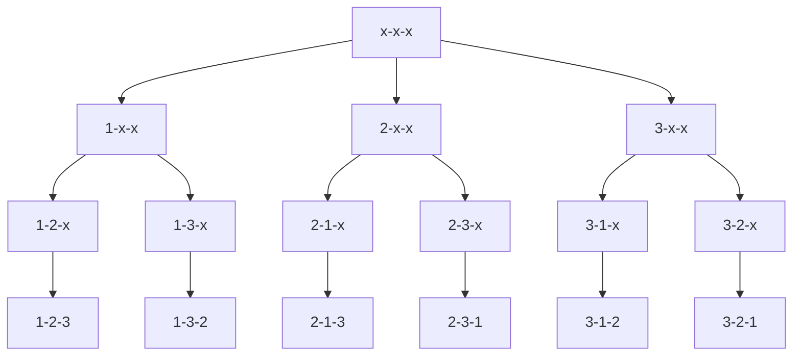

### [842. 排列数字 - AcWing题库](https://www.acwing.com/problem/content/844/)

给定一个整数 $n$，将数字 $1\sim n$ 排成一排，将会有很多种排列方法。

现在，请你按照字典序将所有的排列方法输出。

#### 输入格式

共一行，包含一个整数 $n$。

#### 输出格式

按字典序输出所有排列方案，每个方案占一行。

#### 数据范围

$1 \leq n \leq 7$

#### 输入样例：

```
3
```

#### 输出样例：

```
1 2 3
1 3 2
2 1 3
2 3 1
3 1 2
3 2 1
```

#### 思路

核心：枚举顺序——依次枚举每个位置放哪个数

递归搜索树（以 $n = 3$ 为例）



#### 代码

```cpp
#include <iostream>

using namespace std;

const int N = 10;

int n;
int q[N];// 用来存放当前位置放什么数
bool st[N];// 记录该数值是否被用过

void dfs(int u){
    if(u == n){
        for(int i = 0; i < n; i++) cout << q[i] << ' ';
        cout << endl;
        return ;
    }
    for(int i = 0; i < n; i++){// 枚举当前位置可以填什么数
        if(st[i] == false){
            st[i] = true;
            q[u] = i + 1;
            dfs(u + 1);
            st[i] = false;// 还原现场
        }
    }
}

int main(void){

    cin >> n;

    dfs(0);

    return 0;
}
```


*2022-07-29 周五*