### [题目详情 - 习题2.8 输出全排列 (pintia.cn)](https://pintia.cn/problem-sets/434/problems/5811)

#递归 #位运算 #vector #DFS

请编写程序输出前 $n$ 个正整数的全排列$（n<10）$，并通过 $9$ 个测试用例（即 $n$ 从 $1$ 到 $9$ ）观察 $n$ 逐步增大时程序的运行时间。

### 输入格式:

输入给出正整数 $n（<10）$。

### 输出格式:

输出 $1$ 到 $n$ 的全排列。每种排列占一行，数字间无空格。排列的输出顺序为字典序，即序列 $a_1,a_2,⋯,a_n$ 排在序列 $b_1,b_2,⋯,b_n$ 之前，如果存在 $k$ 使得 $a_1=b_1,⋯,a_k=b_k$ 并且 $a_{k+1}<b_{k+1}$。

### 输入样例：

```in
3
```

### 输出样例：

```out
123
132
213
231
312
321
```

### 思路

核心：枚举顺序——依次枚举每个位置放哪个数

递归搜索树（以 $n = 3$ 为例）

```mermaid
graph TB
x-x-x --> 1-x-x
1-x-x --> 1-2-x
1-2-x --> 1-2-3
1-x-x --> 1-3-x
1-3-x --> 1-3-2
x-x-x --> 2-x-x
2-x-x --> 2-1-x
2-1-x --> 2-1-3
2-x-x --> 2-3-x
2-3-x --> 2-3-1
x-x-x --> 3-x-x
3-x-x --> 3-1-x
3-1-x --> 3-1-2
3-x-x --> 3-2-x
3-2-x --> 3-2-1
```




### 代码

方法一：数组快

```cpp
#include <iostream>

using namespace std;

const int N = 10;

int n;
int q[N];// 用来存放当前位置放什么数
bool st[N];// 记录该数值是否被用过

void dfs(int u){
    if(u > n){
        for(int i = 1; i <= n; i++) printf("%d", q[i]);
        puts("");
        return ;
    }
    else{
        for(int i = 1; i <= n; i++){// 枚举当前位置可以填什么数
            if(st[i] == false){
                st[i] = true;
                q[u] = i;
                dfs(u + 1);
                st[i] = false;// 还原现场
            }
        }
    }
}

int main(void){

    scanf("%d", &n);

    dfs(1);

    return 0;
}
```

方法二：STL慢（没看懂）

```cpp
#include <iostream>
#include <vector>

using namespace std;

int n;

vector<int> path;

void dfs(int u, int state){// u记录枚举到了第几个数，state看作二进制数，表示哪些数已经被使用过了

    if(u == n){
    if(u == n){
        for(auto x : path) cout << x;
        cout << endl;
        return ;
    }
    for(int i = 0; i < n; i++){
        if(!(state >> i & 1)){
            path.push_back(i + 1);
            dfs(u + 1, state | (1 << i));
            path.pop_back();
        }
    }
}

int main(void){

    cin >> n;

    dfs(0, 0);

    return 0;
}
```


*2022-06-27 周一*