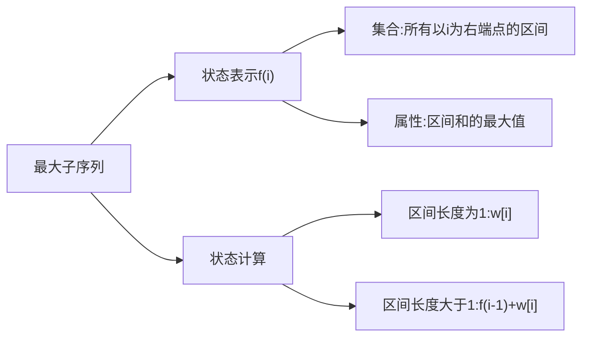

### [题目详情 - 实例1.1 最大子列和问题 (pintia.cn)](https://pintia.cn/problem-sets/434/problems/5404)

#动态规划 #分治 #子列

给定K个整数组成的序列 ${ N_1, N_2, ..., N_K }$，“连续子列”被定义为 ${ N_i, N_{i+1}, ..., N_j }$，其中 $1≤i≤j≤K$。“最大子列和”则被定义为所有连续子列元素的和中最大者。例如给定序列 ${ -2, 11, -4, 13, -5, -2 }$，其连续子列 ${ 11, -4, 13 }$有最大的和 $20$。现要求你编写程序，计算给定整数序列的最大子列和。

本题旨在测试各种不同的算法在各种数据情况下的表现。各组测试数据特点如下：

- 数据1：与样例等价，测试基本正确性；
- 数据2：$10^2$个随机整数；
- 数据3：$10^3$个随机整数；
- 数据4：$10^4$个随机整数；
- 数据5：$10^5$个随机整数；

### 输入格式:

输入第 $1$ 行给出正整数 $K (≤100000)$；第 $2$ 行给出 $K$ 个整数，其间以空格分隔。

### 输出格式:

在一行中输出最大子列和。如果序列中所有整数皆为负数，则输出 $0$。

### 输入样例:

```in
6
-2 11 -4 13 -5 -2
```

### 输出样例:

```out
20
```

### 思路

##### 动态规划

有限集合中求最值的问题,典型的Dp



当区间长度大于 $1$ 时

- $\color{ Yellow}{i,}$ $i - 1$
- $\color{ Yellow}{i,}$ $i - 1,i-2$
- $......$
- $\color{ Yellow}{i,}$ $i-1,i-2,...,2,1$

如果想让最大值最大,就需要让右半边最大,则右半边的最大值就是 $f(i-1)+w[i]$ 

故状态方程为:
$$
\begin{aligned}
f(i)~=~&max(w_i,f(i-1)+w_[i])\\
	=~&w_i+max(f(i - 1), 0)
\end{aligned}
$$
且由于每一个 $f(i)$ 只会用到 $f(i-1)$ ,故只需要开一个 $f$ 变量来存储就可以


##### 归并
最大子列和出现的三种情况
1. 分布在左半边
	- `max_left_sum = merge(l, mid);`
2. 分布在右半边
	- `max_right_sum = merge(mid + 1, r);`
3. 分布在左右两侧
	- `max3(max_left_sum, max_right_sum, left_sum + right_sum);`
最后再进行一次取最大值

### 代码

##### 动态规划

```cpp
#include <iostream>

using namespace std;

const int N = 1e5 +10;

int n;
int q[N];

int main(void){

    cin >> n;

    for(int i = 1; i <= n; i++) scanf("%d", &q[i]);

    int res = 0;

    for(int i = 1, f = 0; i <= n; i++){
        f = q[i] + max(f, 0);// 递推公式
        res = max(res, f);// 取最大值
    }

    cout << res << endl;

    return 0;
}
```

##### 分治

```cpp
#include <iostream>

using namespace std;

const int N = 1e5 + 10;

int n;
int q[N];

int max3(int a, int b, int c){
    int tmp = a > b ? a : b;
    return tmp > c ? tmp : c;
}

int merge(int l, int r){
    if(l >= r) return q[l];
    
    int mid = l + r >> 1;// 确定中间点
    int max_left_sum = merge(l, mid);
    int max_right_sum = merge(mid + 1, r);
	// 先归并,再计算
		
    int left_sum = 0, left_tmp = 0;
    for(int i = mid; i >= l; i--){// 判断左侧最大子序列
        left_tmp += q[i];
        left_sum = max(left_sum, left_tmp);
    }

    int right_sum = 0, right_tmp = 0;
    for(int i = mid + 1; i <= r; i++){// 判断右侧最大子序列
        right_tmp += q[i];
        right_sum = max(right_sum, right_tmp);
    }

    // 因为需要判断处于中间的最大子序列，
    // 故左侧从分界点向左侧循环， 右侧从分界点向右侧循环

    return max3(max_left_sum, max_right_sum, left_sum + right_sum);
    // 以为是判断最大子序列,故进行一个取最值
}

int main(void){

    cin >> n;

    int tmp = 0;
    for(int i = 0; i < n; i++){
        scanf("%d", &q[i]);
        if(q[i] < 0) tmp++;
    }

    if(tmp == n) puts("0");
    else printf("%d\n", merge(0, n - 1));

    return 0;
}
```


*2022-06-26 周日*